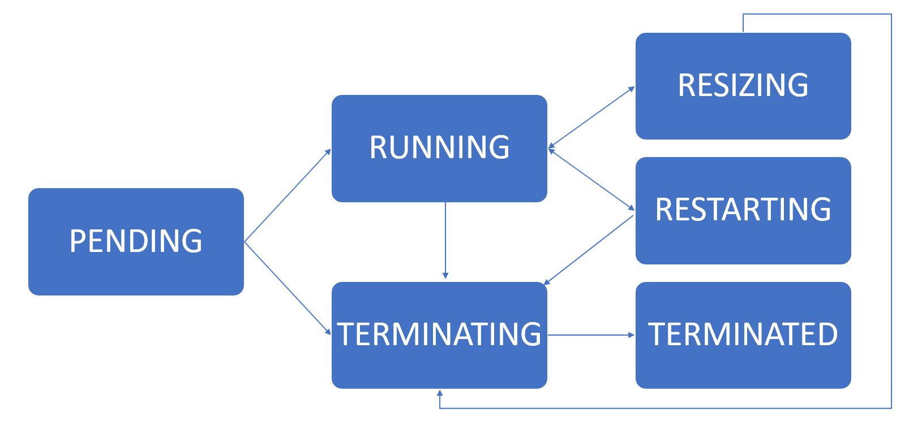

# Image Rendering Test

This page tests whether DocMaker correctly renders images in the MATLAB Help Browser.

## Inline Image

Here is an image referenced with standard markdown syntax:

## Text After Image

If you can see the image above, rendering is working correctly.
If the image is invisible or broken, it confirms the lazy-loading bug.
